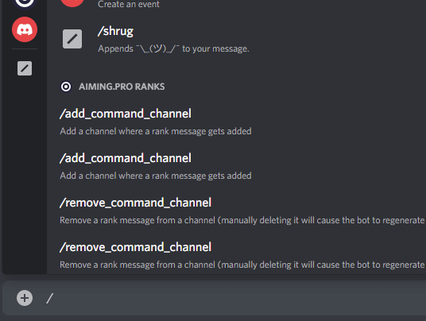

# Scheduler

Fun and easy bot to coordinate events.

Doesn't have any security features, but it's easy to use. Don't use
this on a public server as anyone can add and remove events.

[Invite](https://discord.com/api/oauth2/authorize?client_id=980874521722646548&permissions=277025523712&scope=bot%20applications.commands)

The bot will also probably break if you're creating events from a different
timezone than the bot is running in (Berlin, in this case) and the dates
will be off by a few hours.
